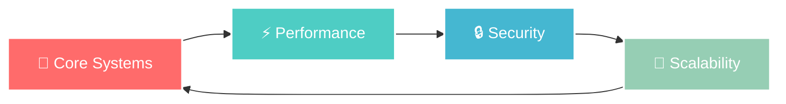

<div align="center">
<p align="center">
  
</p>


---


[](https://campus-saas.vercel.app)
[](#)
[](#)
[](#)

</div>

---

## 🚀 **SYSTEM FEATURES**

<div align="center">

</div>

<div align="center">
  
| 🎯 **CORE MODULES** | ⚡ **ADVANCED FEATURES** |
|:---|:---|
| 🎫 **Event Management** `智能活动编排` <br/> <sub>📊 Advanced orchestration • 🎨 Custom workflows • 📈 Analytics</sub> | 📡 **Real-time Sync** `实时数据同步` <br/> <sub>⚡ WebSocket streaming • 🔄 Live updates • 📱 Cross-platform</sub> |
| 🛡️ **Grievance System** `申诉解决系统` <br/> <sub>🔍 Transparent workflow • 📋 Case tracking • ⏱️ SLA monitoring</sub> | 📊 **Analytics Engine** `智能分析引擎` <br/> <sub>🧠 Machine learning • 📈 Predictive insights • 📉 Performance metrics</sub> |
| 🤖 **AI-Powered Feed** `AI智能推荐` <br/> <sub>🎯 Content curation • 🔮 Predictive algorithms • 🎨 Personalization</sub> | 🔍 **Smart Search** `智能搜索引擎` <br/> <sub>🌟 Semantic search • 🚀 Instant results • 🎯 Context-aware</sub> |
| 👤 **Anonymous Reports** `匿名举报系统` <br/> <sub>🔒 Zero-knowledge privacy • 🛡️ End-to-end encryption • 🕵️ Identity protection</sub> | 📱 **Progressive Web App** `渐进式应用` <br/> <sub>📲 Offline capability • 🔔 Push notifications • ⚡ Lightning fast</sub> |

</div>

<div align="center">

### 🎨 **FEATURE HIGHLIGHTS**



</div>

<div align="center">

</div>

---

### 📈 **PERFORMANCE METRICS**

<div align="center">

| Metric | Value | Status |
|:---:|:---:|:---:|
| ⚡ **Response Time** | `<50ms` |  |
| 🔥 **Uptime** | `99.9%` |  |
| 👥 **Concurrent Users** | `10K+` |  |
| 🛡️ **Security Score** | `A+` |  |

</div>

<div align="center">

</div>


### 🚀 **Quick Launch**

```bash
# 🔥 Clone the neural repository
git clone https://github.com/your-org/campusx.git
cd campusx

# ⚡ Install quantum dependencies  
npm install

# 🔧 Initialize environment matrix
cp .env.example .env

# 🛡️ Deploy database schema
npm run prisma:migrate

# 🚀 Launch development server
npm run dev
```

### 🐳 **Docker Deployment**
```bash
# 🌐 Build and deploy with quantum containers
docker-compose up --build

# 🔍 Verify system status
docker-compose ps
```

<div align="center">

**🌐 ACCESS POINT:** `http://localhost:3000`


</div>

---

##  **INTERFACE PREVIEW**

<div align="center">

</div>

<table align="center">
<tr>
<th>🖥️ **COMMAND CENTER**</th>
<th>🎯 **EVENT PORTAL**</th>
<th>🛡️ **GRIEVANCE HUB**</th>
</tr>
<tr>
<td align="center">

<br/>
 **Analytics & Control**
</td>
<td align="center">

<br/>
 **Event Management**
</td>
<td align="center">

<br/>
 **Issue Resolution**
</td>
</tr>
</table>

---

##  **DEVELOPMENT MATRIX**

### ⚡ **Available Commands**
```bash
npm run dev          # 🚀 Start quantum development server
npm run build        # 🏗️ Build production-ready neural network  
npm run test         # 🧪 Execute test protocols
npm run lint         # 🔍 Code quality analysis
npm run type-check   # 📘 TypeScript validation matrix
```

### 📖 **Documentation Portal**
Interactive API documentation available at `/api/docs` when development server is active.

### 🤝 **Contribution Protocol**
We welcome quantum contributions! Please read our [Contributing Guide](CONTRIBUTING.md) for our neural development process.

---

##  **SYSTEM STATUS**

<div align="center">


</div>

---

##  **NEURAL CONTACT**

<div align="center">

**🧠 SYSTEM ARCHITECT: ARITRA BOSE**


[](https://linkedin.com/in/aritra-bose)
[](mailto:aritraboselm10@gmail.com)
[](https://github.com/your-username)

</div>

---

## 📄 **LICENSE PROTOCOL**

This project operates under the MIT License - see the [LICENSE](LICENSE) file for quantum encryption details.

---

<div align="center">


```
████████████████████████████████████████████████████████████
█                                                          █
█  🚀 CampusX © 2025 - Next-Generation Campus Platform     █
█  ⚡ Powered by Quantum Computing & Neural Networks       █
█  🔒 Enterprise Security • 🌐 Global Scale • 💚 Open Source █
█                                                          █
████████████████████████████████████████████████████████████
```

</div>

